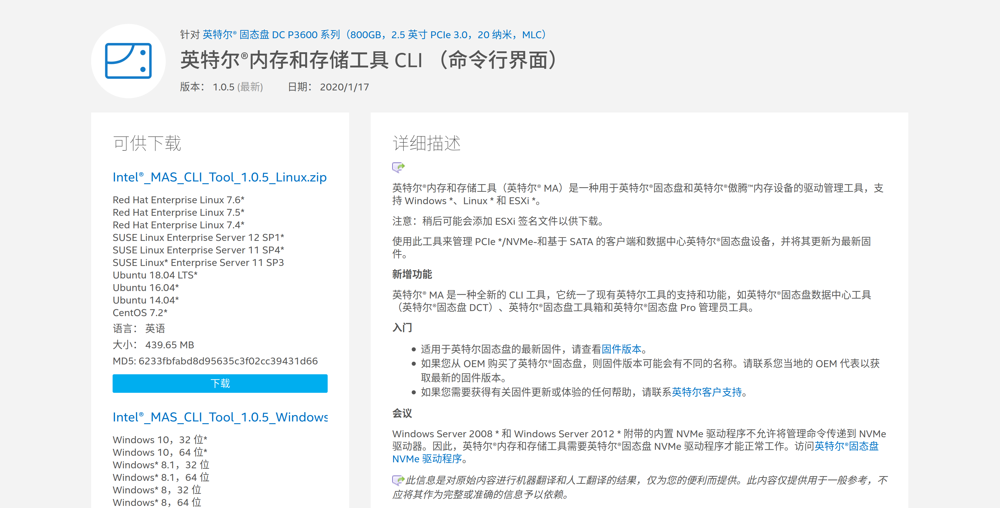
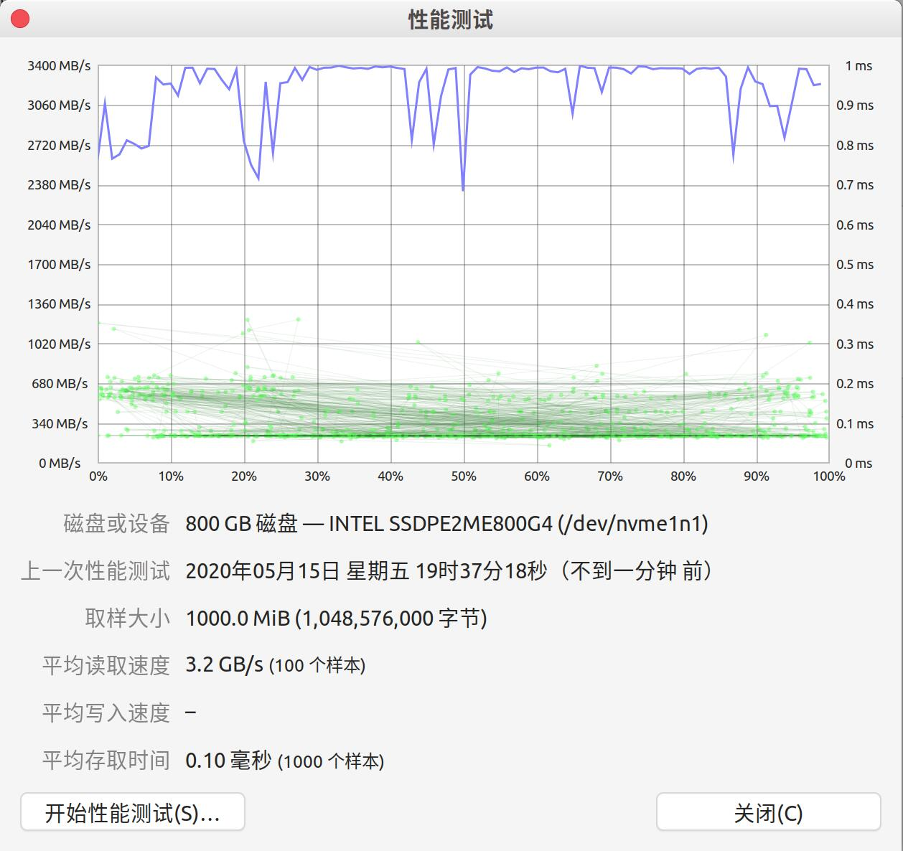

# Install firmware for P3600

### Basic situations

I use an Intel SSD for my linux system. It is a 800G P3600 drive running by PCI-e and NVMe.

Ubuntu can drive this NVMe disk out of the box, but in the daily use I found that Ubuntu cannot tap this drive to the full. When I copy a file from another NVMe SSD to this SSD, the speed is only about several hundred MB/s. Considering I installed a firmware from Intel when I installed Windows in this SSD, I guess a firmware may also be needed in linux. So I started to look up.

### Find Intel firmware

After a simple look-up, I found the firmware from the [official website](https://downloadcenter.intel.com/zh-cn/download/29337/-CLI-?product=80999) that support my SSD(P3600) and my system(Ubuntu 18.04), so I installed it.

After installing the Intel MAS, I found the speed of this SSD didn't change. So I put this thing aside. 

### Install the firmware successfully

Several weeks later, I read the [manual](https://downloadmirror.intel.com/29337/eng/Intel_Memory_And_Storage_Tool_User%20Guide-Public-342245-001US.pdf) from Intel carefully again, and I found the detailed information about how to use the command line tool. By simply running ``intelmas load -intelssd 1``, I managed to update the firmware of my SSD. The ``1`` in this command specifies which hard drive the command is targeted at. The number of the SSD can be got by running ``intelmas show -intelssd``, the result is like the picture downward, and the "Index" is the specific number for your drive.

### Do some speed tests

Firstly, I copied a virtual machine from another NVMe SSD to this SSD to test the writing speed. The speed was about 2GB/s, so I know that the firmware installation should be of no problem.

But I also want to test the reading speed, so I looked up for it. In linuxcn, I found this [article](https://zhuanlan.zhihu.com/p/33752337) that is quite useful.

In this article, there are three ways to test the speed, using ``dd`` command, using ``hdparm`` command, or using the ``disk`` application from gnome.  The latter two means can only test the reading speed, while ``dd`` command can only test the writing command.

By running ``sudo hdparm -t /dev/nvme1n1p2``, I got a pretty nice score. It partly depends on the file system.

Also, I used the disk application from gnome. I ran 1000MiB reading test for 100 times, and it shows the raw capacity of this SSD, quite impressive. 

Later, I wrote a [shell script](https://github.com/bill-ginger/Play-with-Ubuntu/blob/master/Intel-SSD-firmware/dd-read-test.sh) to use run ``dd`` for several times. 

In general, I am very glad that I have solved the problem about the SSD speed, and the SSD is also very powerful. 
