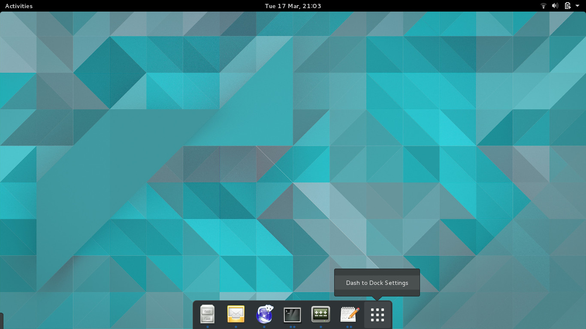
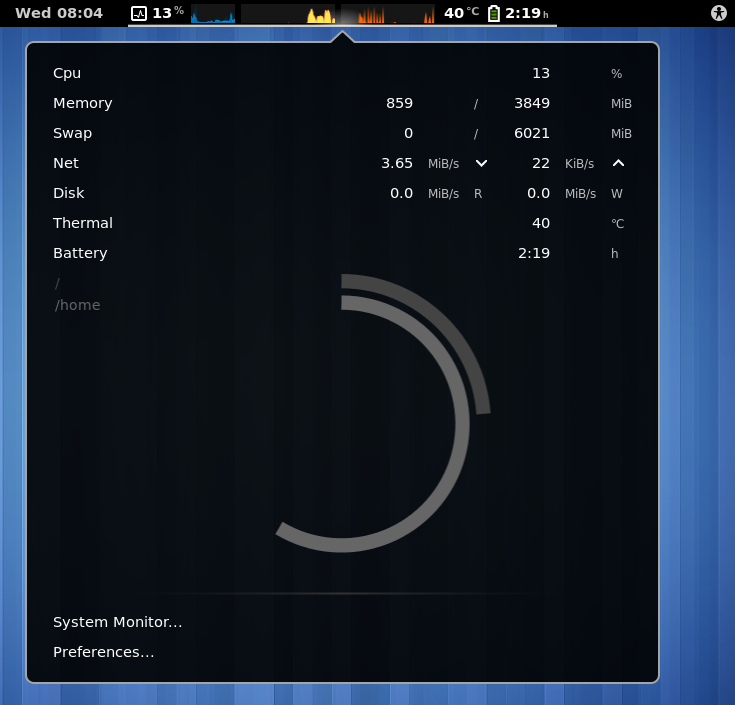
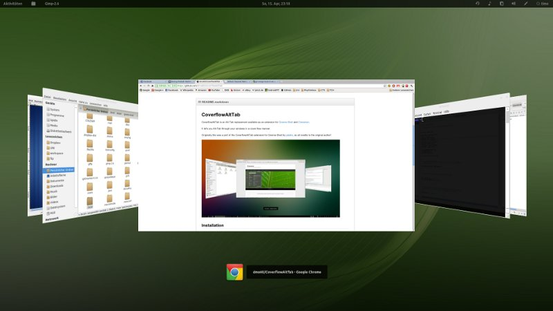

# GNOME shell extensions

The official site of GNOME shell extensions is [https://extensions.gnome.org](https://extensions.gnome.org/), you can search for and install the extensions you want here.

### Manage

You can use "gnome-tweak-tool" to manage your shell extensions. Run 

```
sudo apt install gnome-tweak-tool
sudo apt-get install gnome-shell-extensions
```

in terminal to install it. All your installed extensions can be seen in the "extension" tab.

### Install

If you want to install extensions directly from the website, you should get a "native host connector" first.

On FireFox, the native host connector is an extension called GNOME Shell integration. You will be asked to install it if you install GNOME extensions from the website by FireFox.

If you use Chrome, there is a similar extension. And you can also get it using command ``sudo apt-get install chrome-gnome-shell``.

After you get the native host extension, you can install whatever extensions you want by simply click the "on" button. (You can also turn the extension off this way)

### Recommendations

- [Dash to dock](https://extensions.gnome.org/extension/307/dash-to-dock/)

  A dock for the GNOME Shell, essential if you want to DIY a MacOS theme.

  

- [Clipboard indicator](https://extensions.gnome.org/extension/779/clipboard-indicator/)

  To show your clipboard history

- [Internet Speed Meter](https://extensions.gnome.org/extension/2980/internet-speed-meter/)

  Simple but powerful, show the sum of uploads and downloads speed, no customizing settings

- [Topicons](https://extensions.gnome.org/extension/495/topicons/)

  Essential if want to make icons of QQ or WeChat lie in the top bar

- [User themes](https://extensions.gnome.org/extension/19/user-themes/)

  Essential if you want to use customized gnome themes.

- [System-monitor](https://extensions.gnome.org/extension/120/system-monitor/)

  Show CPU usage, memory usage, etc. in graphics.

- [Appfolders management extension](https://extensions.gnome.org/extension/1217/appfolders-manager/)

  You can arrange your applications on the launch screen into folders

- [Blyr](https://extensions.gnome.org/extension/1251/blyr/)

  Make a blurry effect on the wallpaper background when you open the launch screen(Super-A) or see your activities(left Super)

- [Coverflow alt-tab](https://extensions.gnome.org/extension/97/coverflow-alt-tab/)

  Show a fancy effect when you switch applications

  

- [Unite](https://extensions.gnome.org/extension/1287/unite/)

  Squeeze the title bar of applications into top bar when the application takes full screen